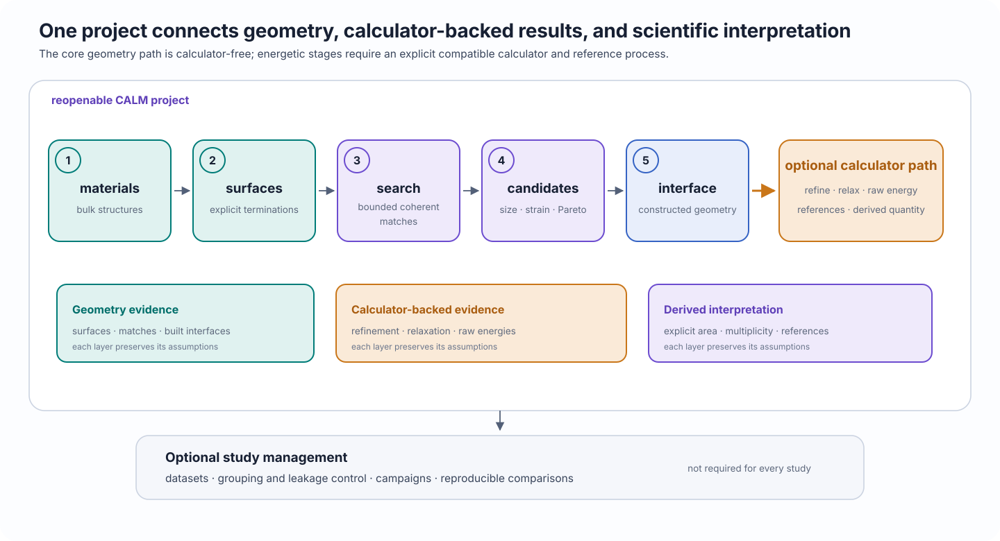

# CALM: coherent interface modeling

<p class="calm-lede">
CALM constructs periodic coherent solid–solid interface models from explicit bulk structures and surface choices, then preserves the workflow so the study can be reopened, inspected, refined, and reproduced.
</p>

<div class="calm-page-facts" markdown>
- **First workflow:** calculator-free interface construction
- **Public API:** one top-level `calm` namespace
- **Saved work:** reopenable project directories
- **Optional stages:** calculator-backed refinement, relaxation, and energetics
</div>

## What CALM does

CALM supports a connected scientific workflow:

- import or prepare bulk material structures;
- generate finite surface models for explicit Miller orientations;
- select the exact surface terminations that will meet;
- search bounded surface supercells for coherent periodic matches;
- inspect size, strain, buildability, and Pareto tradeoffs;
- construct one or more atomistic interfaces;
- refine strain allocation and in-plane registry;
- run optional calculator-backed relaxation and energy workflows; and
- assemble reproducible datasets or campaigns from saved results.

Every normal workflow begins with a project:

```python
import calm

project = calm.open_project("interface-study.calm")
print(project.summary())
```

The project saves user inputs, settings, results, and their relationships. It is the normal boundary for continuing a study without reconstructing state from filenames or notebook history.

## Workflow at a glance

<figure class="calm-figure calm-figure--wide" markdown>

[](assets/figures/site/calm-workflow-map.svg)
  <figcaption>The geometry path through interface construction does not require a calculator. Refinement metrics based on energy, relaxation, raw energies, and calculated reference states require a compatible calculator. Datasets and campaigns are optional study-management layers rather than mandatory final stages.</figcaption>
</figure>

The workflow has three distinct evidence layers:

1. **Geometry:** surfaces, coherent matches, candidates, and constructed interfaces.
2. **Calculator-backed results:** refined registries, relaxed structures, raw energies, and reference calculations.
3. **Derived scientific quantities:** values such as work of adhesion, available only when the required compatible references and conventions are explicit.

A later layer does not retroactively validate the assumptions of an earlier one. For example, relaxation convergence does not prove that the selected termination or coherent model is physically preferred.

## Start with one interface

The shortest complete path is the calculator-free first tutorial. From the repository root:

```bash
conda env create -f environments/calm-science.yml
conda activate calm-science
python -m pip install -e . --no-deps
python environments/validate_environment.py --profile science
python examples/tutorials/first_interface.py \
  --work-dir examples/work/first-interface \
  --reset
```

The program uses package-owned LiF and Li₂O structures and creates:

```text
examples/work/first-interface/
├── first-interface.calm/
└── outputs/
    ├── interfaces.csv
    ├── run-summary.json
    └── <exported interface structure>
```

The result is saved and buildable, but it is **constructed and unrelaxed**. Continue with [Build your first interface](learn/first-interface.md) for the decisions and interpretation behind each operation.

## Choose your path

<div class="calm-card-grid" markdown>
- **Learn CALM**<br>
  Follow three tested tutorials: [build an interface](learn/first-interface.md), [compare candidates](learn/compare-candidates.md), then [refine, relax, and evaluate](learn/refine-relax-evaluate.md).

- **Use CALM**<br>
  Open the chapter for the task at hand: [projects](use/projects.md), [materials](use/materials.md), [surfaces](use/surfaces.md), [searches](use/searches.md), [construction and refinement](use/build-refine.md), [relaxation and evaluation](use/relax-evaluate.md), or [datasets and campaigns](use/datasets-campaigns.md).

- **Understand the science**<br>
  Read the interpretation-oriented chapters on [surface models](understand/surface-models.md), [surface supercells](understand/surface-supercells.md), [coherent matching and strain](understand/coherent-matching.md), [strain partitioning and registry](understand/strain-registry.md), and [energy reference conventions](understand/energetics.md).

- **Look something up**<br>
  Use the [public API reference](reference/public-api.md), [units and conventions](reference/units-conventions.md), [terminology](reference/terminology.md), [supported scope](reference/supported-scope.md), [calculator support](reference/calculator-support.md), or the two troubleshooting indexes.
</div>

## Scientific limits

CALM makes modeling choices explicit; it does not make them scientifically correct by itself.

CALM does not infer:

- the physically stable surface termination;
- whether a coherent interface is preferred over an incoherent, defective, reconstructed, charged, or chemically transformed interface;
- whether the lowest-strain or highest-ranked geometric candidate is experimentally preferred;
- whether an installed calculator is accurate for the selected elements and environments;
- whether a converged relaxation is the global minimum; or
- which thermodynamic reference convention answers the scientific question.

A low-strain candidate is a useful geometric result, not a stability prediction. A calculator that executes successfully is technically usable, not automatically scientifically suitable. A derived interfacial quantity is meaningful only with its declared area, interface multiplicity, calculator identity, structures, relaxation protocol, and reference cycle.

See [Supported scientific scope](reference/supported-scope.md) before interpreting CALM outputs beyond their declared workflow stage.

## Public API

All supported imports originate from `calm`:

```python
from calm import Material, SearchSettings, open_project, tutorial_structure

project = open_project("study.calm")
material = Material.from_ase(tutorial_structure("lif"), name="LiF")
settings = SearchSettings(max_principal_strain=0.10)
```

Do not teach or depend on implementation package paths. The [public API overview](reference/public-api.md) explains the supported boundary and links to exact live signatures.

## Next step

- New installation: [Install CALM](install.md)
- First successful workflow: [Build your first interface](learn/first-interface.md)
- Existing study: [Projects](use/projects.md)
- Scientific interpretation: [Understand](understand/surface-models.md)
