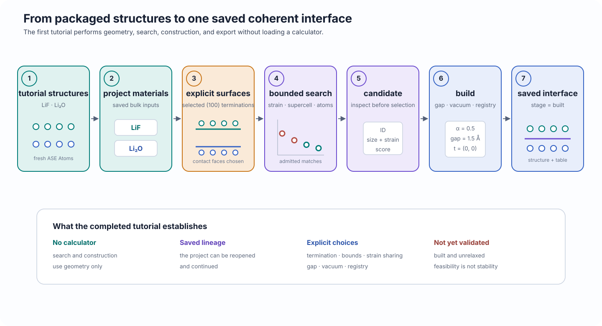

# Build your first interface

<p class="calm-lede">
Construct a calculator-free LiF/Li₂O coherent interface, save it in a CALM project, and export the resulting structure and construction table.
</p>

<div class="calm-page-facts" markdown>
- **Outcome:** one saved, constructed, and unrelaxed interface
- **Calculator:** not required
- **Inputs:** package-owned LiF and Li₂O tutorial structures
- **Canonical program:** `examples/tutorials/first_interface.py`
</div>

## Outcome

This tutorial follows the shortest complete CALM geometry workflow:

1. open a project;
2. add two bulk materials;
3. generate (100) surface models;
4. select one explicit termination from each material;
5. search for bounded coherent matches;
6. build the top candidate; and
7. export the interface structure and a construction table.

The final interface is **constructed but not relaxed**. CALM has found a periodic geometric match and assembled the two slabs; it has not established that this interface is stable or experimentally preferred.

<figure class="calm-figure calm-figure--wide" markdown>

[](../assets/figures/tutorials/first-interface-workflow.svg)
  <figcaption>The first tutorial is entirely geometric. It creates saved materials, surfaces, a search, candidates, and one built interface without loading an atomistic calculator.</figcaption>
</figure>

## Prerequisites

Use a CALM environment with the scientific geometry dependencies available. These checks should succeed:

```bash
python -c "import calm, ase, spglib"
```

The tutorial structures are installed with CALM. You do not need a source checkout, POSCAR files, or a particular working directory.

The program refuses to overwrite a nonempty output directory unless `--reset` is supplied. Run it from the repository checkout with:

```bash
python examples/tutorials/first_interface.py \
  --work-dir examples/work/first-interface \
  --reset
```

## Workflow

### 1. Use only the supported public API

The canonical program imports all CALM objects from the top-level namespace:

```python
--8<-- "examples/tutorials/first_interface.py:first-interface-imports"
```

`tutorial_structure()` returns a fresh ASE `Atoms` object on each call. The material definitions therefore do not depend on mutable shared objects or repository files.

### 2. Add materials and choose explicit surfaces

```python
--8<-- "examples/tutorials/first_interface.py:first-interface-materials-surfaces"
```

`generate_surfaces()` creates the finite slabs available for the requested Miller orientation. The later `project.surface(...)` calls make the contact-face choices explicit:

- LiF uses the termination labeled `LiF` with shift `0`;
- Li₂O uses the surface whose bottom termination is O with shift `1`.

CALM does not infer which termination is physically correct. The selected surfaces define the model you ask CALM to match and assemble.

### 3. Search for bounded coherent matches

```python
--8<-- "examples/tutorials/first_interface.py:first-interface-search"
```

The search is bounded by four controls:

| Setting | Role in this tutorial |
|---|---|
| `max_principal_strain=0.15` | Rejects candidates whose largest absolute principal strain exceeds 15%. |
| `max_supercell_index=12` | Limits the surface-supercell enumeration. |
| `max_atoms=1000` | Rejects candidate interfaces estimated to exceed 1000 atoms. |
| `max_candidates=500` | Caps the number of retained candidates. |

`search.empty` detects a search with no admissible candidates. `buildability_summary()` then checks whether the saved search result contains the information needed for construction.

These bounds are deliberately permissive enough for a first run. They are not recommended settings for every material pair.

### 4. Build and export one candidate

```python
--8<-- "examples/tutorials/first_interface.py:first-interface-build-export"
```

The build settings make each geometric choice explicit:

- `strain_partition="both"` and `alpha=0.5` share the coherent deformation equally;
- `gap=1.5` Å sets the initial separation between the contact faces;
- `vacuum=15.0` Å separates periodic images normal to the interface;
- `translation=(0.0, 0.0)` uses the unshifted in-plane registry.

`build_interfaces(..., top=1)` constructs the first selected candidate and saves it under the prefix `first-interface`. The returned collection contains in-memory interface models for geometry export. The tutorial separately queries `project.interface("first-interface_0000")` when it needs the saved label and workflow stage.

## Inspect the result

The program creates this directory layout:

```text
examples/work/first-interface/
├── first-interface.calm/
└── outputs/
    ├── interfaces.csv
    ├── run-summary.json
    └── <one exported VASP structure>
```

The CALM project is the reopenable study. The files under `outputs/` are exports for inspection and use by other tools.

Inspect the machine-readable summary:

```bash
python -m json.tool \
  examples/work/first-interface/outputs/run-summary.json
```

## Expected output

The stable success conditions are:

- the search contains at least one candidate;
- one interface is saved;
- the saved interface stage is `built`;
- `interfaces.csv` and `run-summary.json` exist;
- at least one VASP structure is exported.

A verified run with the current tutorial structures produced:

```text
[tutorial] outcome: one saved, constructed, and unrelaxed LiF/Li2O interface
[tutorial] project: examples/work/first-interface/first-interface.calm
[tutorial] search candidates: 60
[tutorial] interface: first-interface_0000 (built)
```

The exact candidate count is not part of the tutorial contract. Changes to search algorithms, numerical tolerances, or tutorial structures may change that count while preserving the scientific workflow.

## Interpretation

At this point CALM has established that the selected surfaces admit at least one bounded coherent periodic construction under the declared search limits. The project saves the materials, surfaces, search settings, candidate, build settings, and constructed interface so the study can be reopened and continued.

The result does **not** establish that:

- the selected terminations are the most stable terminations;
- the top-ranked candidate is the experimentally preferred interface;
- the initial gap or registry is energetically favorable;
- the coherent strain is physically accommodated by the real system; or
- the unrelaxed structure is suitable for production simulation.

## Limitations

!!! warning "A built interface is not a validated interface"
    Geometric feasibility is necessary for this coherent model, but it is not evidence of thermodynamic stability. A physically meaningful study must justify its terminations, cell size, strain, registry, calculator, relaxation protocol, and energy references.

This tutorial chooses one candidate automatically to keep the first workflow short. In a real study, inspect the candidate population before construction.

## Next step

Continue with [Compare interface candidates](compare-candidates.md) to examine the strain–size tradeoff and make an explicit candidate-selection decision.
