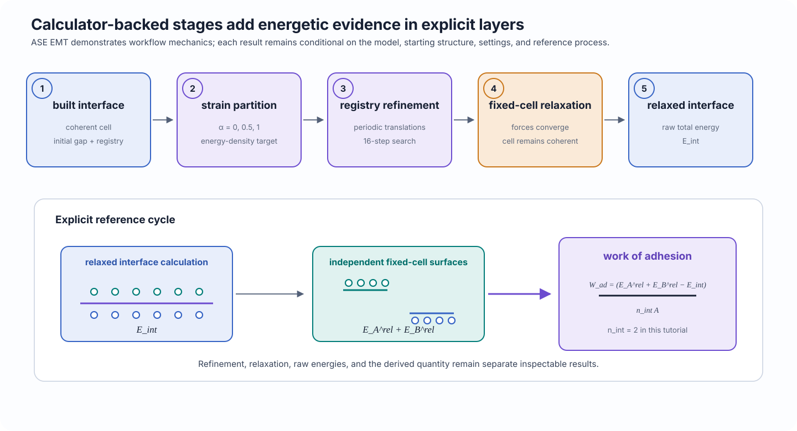

# Refine, relax, and evaluate

<p class="calm-lede">
Use ASE EMT to demonstrate strain-partition refinement, registry refinement, fixed-cell interface relaxation, raw energy evaluation, and work-of-adhesion reference bookkeeping for a Cu/Ni interface.
</p>

<div class="calm-page-facts" markdown>
- **Outcome:** one refined and relaxed Cu/Ni interface with work-of-adhesion results
- **Calculator:** ASE EMT
- **Inputs:** package-owned Cu and Ni tutorial structures
- **Canonical program:** `examples/tutorials/refine_relax_evaluate.py`
</div>

## Outcome

This tutorial introduces the calculator-backed half of the CALM workflow. It creates an independent Cu/Ni study and then:

1. configures ASE EMT;
2. optimizes the two bulk tutorial structures;
3. constructs a coherent (100) interface;
4. compares three strain-partition choices;
5. refines the in-plane registry;
6. relaxes the refined interface at fixed cell;
7. evaluates independently relaxed fixed-cell surface references; and
8. derives a work of adhesion using an explicit reference convention.

<figure class="calm-figure calm-figure--wide" markdown>

[](../assets/figures/tutorials/refine-relax-evaluate.svg)
  <figcaption>Calculator-backed refinement and relaxation produce local optimized structures and raw energies. A derived interfacial quantity exists only after CALM applies the explicitly selected reference process and normalization.</figcaption>
</figure>

## Prerequisites

Install CALM's scientific dependencies and the ASE calculator provider. Confirm that ASE EMT can be constructed:

```bash
python - <<'PY'
from ase.calculators.emt import EMT

print(EMT())
PY
```

Run the canonical program:

```bash
python examples/tutorials/refine_relax_evaluate.py \
  --work-dir examples/work/refine-relax-evaluate \
  --reset
```

The focused automated test for this tutorial is opt-in because it performs real calculator-backed optimization and relaxation:

```bash
CALM_RUN_CALCULATOR_TUTORIAL=1 \
python -m pytest -q tests/examples/test_greenfield_tutorials.py
```

!!! warning "EMT is a workflow demonstration, not a general interface model"
    This tutorial demonstrates CALM's calculator integration and reference bookkeeping for an EMT-compatible Cu/Ni example. It does not establish that EMT is accurate for a user's target material, interface, defect chemistry, magnetic state, or thermodynamic question.

## Workflow

### 1. Configure the calculator and prepare bulk structures

```python
--8<-- "examples/tutorials/refine_relax_evaluate.py:refine-configure-materials"
```

`Potential(family="ase", model="EMT")` identifies the registered ASE provider and EMT model. `project.configure(...)` sets the project default used by downstream calculator-backed stages.

The bulk optimizations use `relax_cell=True` so the tutorial surfaces are generated from material structures optimized by the same calculator later used for the interface and references. The names `Cu-EMT` and `Ni-EMT` distinguish these optimized materials from the imported tutorial structures.

The program then generates (100) surfaces, runs a bounded search, and builds one initial interface with equal strain sharing, a 1.8 Å gap, and 12 Å of vacuum.

### 2. Refine strain partition and registry

```python
--8<-- "examples/tutorials/refine_relax_evaluate.py:refine-strain-registry"
```

The strain-partition scan evaluates three allocations:

| `alpha` | Interpretation |
|---:|---|
| `0.0` | Place the coherent deformation on one side of the interface. |
| `0.5` | Share the deformation equally. |
| `1.0` | Place the coherent deformation on the other side. |

The target metric is potential-energy density in eV/Ų. CALM then explores periodic in-plane registry translations using 16 steps, a translation step of `0.08`, and a fixed random seed for reproducibility.

The refinement result is written before relaxation. This keeps the selected strain and registry choices inspectable even when a later calculation fails.

### 3. Relax the registry-refined interface

```python
--8<-- "examples/tutorials/refine_relax_evaluate.py:refine-relaxation"
```

The relaxation starts from saved interfaces at stage `registry_refined` and uses:

- a force threshold of `0.08` eV/Å;
- at most 150 optimization steps; and
- `relax_cell=False`.

The fixed-cell constraint is important: the coherent in-plane periodic cell remains the one selected by the matching and refinement workflow. Atomic coordinates can relax, but the cell cannot remove the imposed coherent relationship.

A converged relaxation identifies a local minimum reachable from this starting structure and optimizer configuration. It does not prove global stability.

### 4. Evaluate raw and referenced energies

```python
--8<-- "examples/tutorials/refine_relax_evaluate.py:refine-energies"
```

The tutorial declares:

```python
EnergyConvention(
    formula="work_of_adhesion_relaxed_surfaces",
    n_interfaces=2,
)
```

For this convention, CALM independently relaxes the two cleaved slab blocks at fixed cell using the same calculator identity and settings family. It then evaluates the relaxed interface and reference energies.

The work of adhesion is

\[
W_\mathrm{ad}
=
\frac{E_A^\mathrm{rel}+E_B^\mathrm{rel}-E_\mathrm{int}}
     {n_\mathrm{int} A},
\]

where:

- \(E_\mathrm{int}\) is the relaxed interface-cell energy;
- \(E_A^\mathrm{rel}\) and \(E_B^\mathrm{rel}\) are the independently relaxed fixed-cell surface-reference energies;
- \(A\) is the selected interface area; and
- \(n_\mathrm{int}=2\) is the number of equivalent interfaces represented by the periodic cell.

The raw energies remain separate from the derived result. Changing the reference process, area source, or interface multiplicity changes the scientific meaning of the derived quantity.

## Inspect the result

The program creates:

```text
examples/work/refine-relax-evaluate/
├── refine-relax-evaluate.calm/
└── outputs/
    ├── refinement-<outputs>
    ├── relaxation-results.csv
    ├── reference-energies.csv
    ├── raw-energies.csv
    ├── work-of-adhesion.csv
    └── run-summary.json
```

Inspect the summary:

```bash
python -m json.tool \
  examples/work/refine-relax-evaluate/outputs/run-summary.json
```

## Expected output

The stable success conditions are:

- refinement completes successfully;
- at least one relaxation result exists;
- at least one raw interface-energy result exists;
- at least one thermodynamic result exists;
- the declared convention is `work_of_adhesion_relaxed_surfaces`;
- the required CSV files and `run-summary.json` are written.

The program prints a compact completion summary:

```text
[tutorial] outcome: one refined and relaxed Cu/Ni interface with work-of-adhesion results
[tutorial] calculator: ase:EMT (workflow demonstration only)
[tutorial] convention: work_of_adhesion_relaxed_surfaces
[tutorial] thermodynamic results: <one or more>
```

## Interpretation

The three output layers answer different questions:

| Output | What it communicates |
|---|---|
| Refinement results | Which sampled strain allocation and registry minimized the chosen calculator-backed metric. |
| Relaxation results | Whether the selected structures converged under the declared fixed-cell relaxation settings. |
| Raw energies | Calculator total energies for specific saved structures. |
| Work of adhesion | A derived quantity tied to independently relaxed fixed-cell surfaces, area normalization, and two equivalent interfaces. |

The work of adhesion is not an intrinsic property independent of modeling choices. It depends on the terminations, coherent cell, strain state, registry, relaxation protocol, calculator, surface references, area, and interface multiplicity.

## Limitations

This tutorial does not establish that:

- EMT is quantitatively reliable for Cu/Ni interfaces;
- the sampled `alpha` values contain the globally optimal strain allocation;
- 16 registry steps resolve the global registry minimum;
- the relaxation reaches the global structural minimum;
- the finite coherent cell admits all relevant reconstructions;
- the selected surface-reference process matches an experimental thermodynamic path.

If a required reference calculation is missing, incompatible, or unconverged, CALM should report the derived result as unavailable rather than silently combining unrelated energies.

## Next step

The three Learn tutorials establish the full progression. Use the workflow chapters for task-focused work:

- [Searches and candidates](../use/searches.md)
- [Build and refine interfaces](../use/build-refine.md)
- [Relax and evaluate](../use/relax-evaluate.md)

The mathematical interpretation will be developed in:

- [Coherent matching, strain, and Pareto selection](../understand/coherent-matching.md)
- [Strain partitioning and registry](../understand/strain-registry.md)
- [Relaxation, energy, and reference conventions](../understand/energetics.md)
