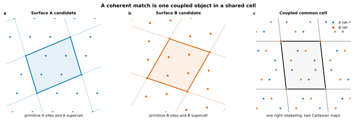
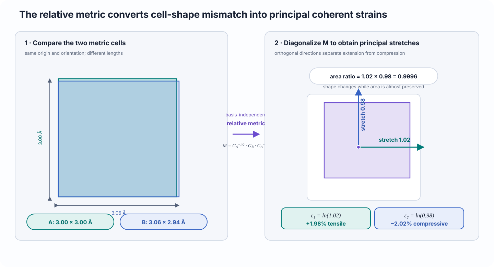
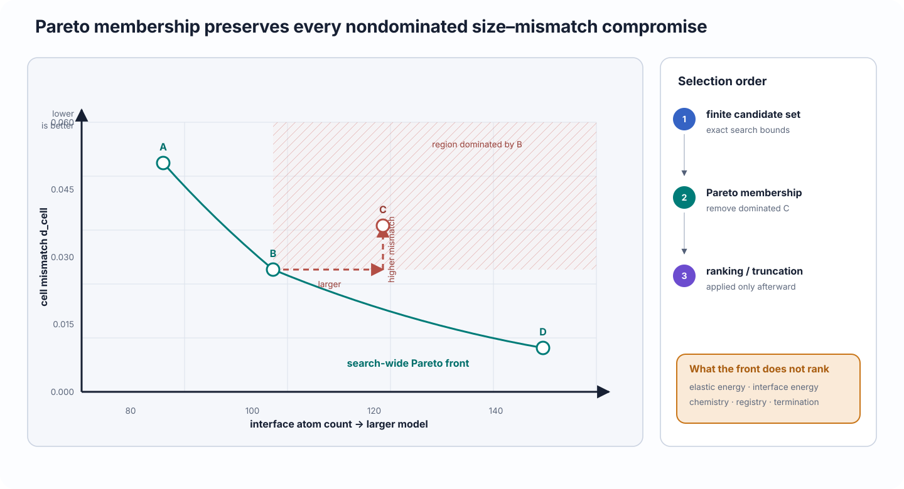

# Coherent matching, strain, and Pareto selection

Understand how two surface supercells are mapped into one periodic cell, how CALM converts metric mismatch into principal logarithmic strains, and why the Pareto front is a set of tradeoffs rather than a scientific ranking.

## Scientific question

Given one selected surface from material A and one from material B, coherent matching asks:

> Can bounded supercells of the two periodic surface lattices be represented in one common in-plane cell without exceeding the admitted strain and size limits?

A successful match defines a geometrically feasible coherent periodic model. It does not determine the preferred termination, registry, strain allocation, relaxed structure, or thermodynamic stability.

## Physical interpretation

A candidate is one coupled object: an A supercell, a B supercell, and the mapping required to compare them in a shared cell.

<figure class="calm-figure calm-figure--wide" markdown>
  Scroll horizontally to inspect the complete figure.

  <figcaption>A coherent candidate couples two surface supercells and their mappings into one periodic cell. The pair must be interpreted together.</figcaption>
</figure>

The mismatch can involve isotropic area change, anisotropic shape change, or both. Principal logarithmic strains express the required stretch and compression along the two principal in-plane directions without depending on the particular basis used to describe the cells.

## Definition

Let the candidate supercell bases be \(\mathbf S_A\) and \(\mathbf S_B\), with Gram metrics

\[
\mathbf G_A=\mathbf S_A^{\mathsf T}\mathbf S_A,
\qquad
\mathbf G_B=\mathbf S_B^{\mathsf T}\mathbf S_B.
\]

The basis-independent relative metric is

\[
\mathbf M
=
\mathbf G_A^{-1/2}\mathbf G_B\mathbf G_A^{-1/2}.
\]

Because \(\mathbf M\) is symmetric positive definite, it has positive eigenvalues \(\mu_1\) and \(\mu_2\). The corresponding principal stretches and Hencky strains are

\[
\lambda_i=\sqrt{\mu_i},
\qquad
\varepsilon_i=\ln\lambda_i
=\frac12\ln\mu_i.
\]

CALM reports the largest absolute principal strain

\[
\varepsilon_{\max}
=
\max(|\varepsilon_1|,|\varepsilon_2|),
\]

which is the quantity constrained by `max_principal_strain`.

<figure class="calm-figure calm-figure--wide" markdown>
  Scroll horizontally to inspect the complete figure.

  <figcaption>The relative metric separates cell mismatch into principal stretches. Equal and opposite strains can change shape strongly while producing little area change.</figcaption>
</figure>

CALM also reports a dimensionless affine-invariant cell distance

\[
d_{\mathrm{cell}}
=
2\sqrt{\varepsilon_1^2+\varepsilon_2^2},
\]

with an area component

\[
d_{\mathrm{area}}
=
\sqrt{2}\,|\varepsilon_1+\varepsilon_2|
\]

and a shape component

\[
d_{\mathrm{shape}}
=
\sqrt{d_{\mathrm{cell}}^2-d_{\mathrm{area}}^2}.
\]

The decomposition is useful because two candidates with similar total mismatch can allocate it differently between area change and anisotropic distortion.

### Pareto dominance

CALM’s saved candidate front compares two objectives:

- estimated interface atom count \(N\);
- cell mismatch \(d_{\mathrm{cell}}\).

Candidate \(x\) dominates candidate \(y\) when

\[
N_x\le N_y,
\qquad
d_x\le d_y,
\]

with a strict improvement in at least one objective. A Pareto candidate is not dominated by any other admitted candidate.

<figure class="calm-figure calm-figure--wide" markdown>
  Scroll horizontally to inspect the complete figure.

  <figcaption>Pareto membership removes candidates that are no better in either size or mismatch. It deliberately preserves several defensible compromises.</figcaption>
</figure>

## How CALM uses it

`Project.search_interfaces()` enumerates bounded pairs of surface supercells, admits those satisfying the declared geometric limits, and saves a queryable candidate population.

Important controls and outputs include:

| Quantity | Role |
| --- | --- |
| `max_supercell_index` | Bounds surface-supercell enumeration. |
| `max_principal_strain` | Rejects candidates whose largest absolute principal Hencky strain is too large. |
| `max_atoms` | Rejects candidates estimated to produce an interface larger than the declared limit. |
| `d_cell` | Reports total metric mismatch. |
| `d_area`, `d_shape` | Separate area and anisotropic-shape contributions. |
| `n_atoms_estimate` | Estimates downstream model size. |
| `is_pareto` | Marks membership in the saved size–mismatch front. |
| `score` | Applies the configured geometric ranking after feasibility and Pareto classification. |

The search score is not an elastic energy, interface energy, or experimental likelihood. It is not a scientific ranking; it is a deterministic geometric ordering within the declared search policy.

## What the user controls

### Strain admission

Choose `max_principal_strain` from the material system and modeling purpose. A compact high-strain cell may be computationally convenient but physically implausible. A strict limit may require a much larger supercell or eliminate the bounded candidate set.

### Search size

Increase `max_supercell_index` and `max_atoms` only when the scientific value of a lower-mismatch candidate justifies the computational cost.

### Candidate selection

Pareto filtering is a useful first reduction. Final selection may additionally consider:

- termination chemistry;
- elastic asymmetry between the materials;
- intended strain partition;
- registry sensitivity;
- reconstruction freedom;
- calculator cost; and
- the need to compare several models rather than one.

### Ranking weight

`mismatch_weight` changes the geometric score. It does not change the underlying principal strains or turn the score into a physical energy.

## Assumptions and limitations

- Coherent matching imposes a common periodic cell and therefore excludes misfit dislocations unless they are explicitly represented in a larger model outside the coherent workflow.
- Principal strain is a geometric measure. It does not determine stress or elastic energy without constitutive information.
- Low mismatch does not imply favorable bonding, registry, surface chemistry, or thermodynamic stability.
- Pareto membership depends on the admitted candidate population and selected objectives. Changing bounds can change the front.
- A finite search cannot prove that no match exists beyond its bounds.
- A low-strain candidate may still constrain reconstructions or other long-wavelength degrees of freedom through finite periodicity.

## Related workflow

- [Surface cells and supercells](surface-supercells.md) defines the candidate lattice cells.
- [Searches and candidates](../use/searches.md) gives the operational search and selection workflow.
- [Compare interface candidates](../learn/compare-candidates.md) works through one Pareto-filtering example.
- [Strain partitioning and registry](strain-registry.md) explains how the accepted mismatch is allocated after a candidate is chosen.
- [Candidate collections](../reference/api/returned-objects.md) lists the exact table views and selection operations.

## References

- A. Zur and T. C. McGill, “Lattice match: An application to heteroepitaxy,” *Journal of Applied Physics* **55**, 378–386 (1984), [doi:10.1063/1.333084](https://doi.org/10.1063/1.333084).
- P. Lazić, “CellMatch: Combining two unit cells into a common supercell with minimal strain,” *Computer Physics Communications* **197**, 324–334 (2015), [doi:10.1016/j.cpc.2015.06.020](https://doi.org/10.1016/j.cpc.2015.06.020).
- P. Neff, B. Eidel, and R. J. Martin, “Geometry of logarithmic strain measures in solid mechanics,” *Archive for Rational Mechanics and Analysis* **222**, 507–572 (2016), [doi:10.1007/s00205-016-1007-x](https://doi.org/10.1007/s00205-016-1007-x).
- M. Ehrgott, *Multicriteria Optimization*, 2nd ed., Springer (2005), [doi:10.1007/3-540-27659-9](https://doi.org/10.1007/3-540-27659-9).
