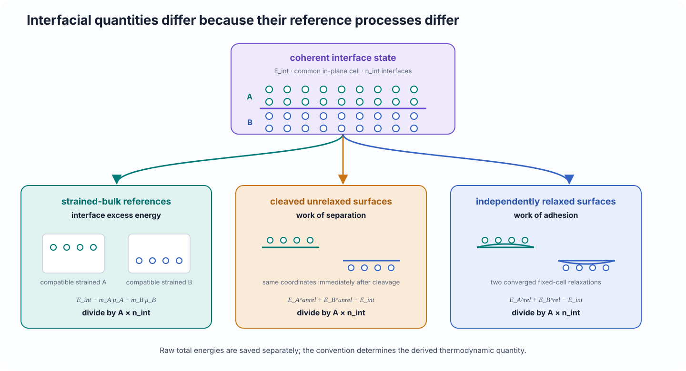

# Relaxation, energy, and reference conventions

Separate local structural relaxation from thermodynamic interpretation, distinguish raw total energies from interfacial quantities, and understand how explicit reference processes define interface excess energy, work of separation, and work of adhesion.

## Scientific question

Calculator-backed interface studies answer two different questions:

1. What nearby structure is obtained under a declared relaxation space and stopping rule?
2. What energetic quantity is defined when that structure is compared with explicit compatible references?

A converged relaxation does not define a thermodynamic reference automatically. A raw total energy is not an interface energy until a subtraction and normalization are declared.

## Physical interpretation

Relaxation explores a local region of the calculator’s potential-energy surface. The allowed atomic and cell degrees of freedom define the physical boundary condition.

For a fixed-cell coherent interface, the in-plane periodic constraint established by matching and strain partitioning is preserved while atoms move. Allowing the cell to relax changes that coherent constraint and requires reference states constructed consistently with the final cell.

Interfacial quantities differ because they represent different reference processes.

<figure class="calm-figure calm-figure--wide" markdown>
  Scroll horizontally to inspect the complete figure.

  <figcaption>Interface excess energy, work of separation, and work of adhesion use different reference states. The same interface total energy can therefore enter several scientifically distinct quantities.</figcaption>
</figure>

## Definition

### Relaxation and convergence

Let the initial structure be \((\mathbf R_0,\mathbf C_0)\), where \(\mathbf R\) denotes atomic coordinates and \(\mathbf C\) the cell. A fixed-cell relaxation seeks a nearby state

\[
(\mathbf R_\star,\mathbf C_0)
\]

that satisfies the declared force stopping rule. A common diagnostic is

\[
f_{\max}
=
\max_i\|\mathbf F_i\|_2.
\]

Meeting the selected threshold establishes optimizer convergence under that protocol. It does not prove uniqueness, global stability, dynamical stability, or finite-size convergence.

### Raw total energy

For structure \(X\) and calculator protocol \(\mathcal C\), the raw potential energy is

\[
E(X;\mathcal C).
\]

It is extensive and depends on composition, atom count, strain, cell, magnetic or electronic state, and calculator settings.

Let the single-interface area be

\[
A=\|\mathbf a\times\mathbf b\|,
\]

and let \(n_{\mathrm{int}}\) be the explicit number of equivalent interfaces represented by the periodic cell. CALM normalizes interfacial quantities by

\[
n_{\mathrm{int}}A.
\]

### Strained-bulk interface excess energy

For compatible strained-bulk reference energies \(\mu_A\) and \(\mu_B\) and formula-unit counts \(n_A\) and \(n_B\),

\[
\gamma_{\mathrm{sb}}
=
\frac{
E_{\mathrm{int}}-n_A\mu_A-n_B\mu_B
}{n_{\mathrm{int}}A}.
\]

This quantity asks what excess remains relative to coherently strained bulk constituents. It is not a work of adhesion.

### Unrelaxed work of separation

For surfaces cleaved from the interface reference while retaining the compatible unrelaxed coordinates,

\[
W_{\mathrm{sep}}^{\mathrm{unrel}}
=
\frac{
E_A^{\mathrm{surf,unrel}}
+E_B^{\mathrm{surf,unrel}}
-E_{\mathrm{int}}
}{n_{\mathrm{int}}A}.
\]

This process measures the energy required to separate the interface without independently relaxing the new surfaces.

### Relaxed work of adhesion

For independently relaxed fixed-cell surface references derived from the final relaxed interface,

\[
W_{\mathrm{ad}}^{\mathrm{rel}}
=
\frac{
E_A^{\mathrm{surf,rel}}
+E_B^{\mathrm{surf,rel}}
-E_{\mathrm{int}}^{\mathrm{rel}}
}{n_{\mathrm{int}}A}.
\]

This reference process includes local surface relaxation while preserving the compatible in-plane cell.

CALM reports energy densities in eV/Ų and, where provided, J/m² using

\[
1\ \mathrm{eV/\mathring A^2}
=
16.02176634\ \mathrm{J/m^2}.
\]

## How CALM uses it

`Project.relax_interfaces()` saves the starting model, settings, calculator identity, terminal structure, status, and convergence diagnostics.

`Project.evaluate_energies()` can save raw total energies alone or combine them with an `EnergyConvention` and compatible references. The supported formulas are:

| Formula identifier | Quantity |
| --- | --- |
| `interface_excess_strained_bulk` | interface excess energy |
| `work_of_separation_unrelaxed_surfaces` | unrelaxed work of separation |
| `work_of_adhesion_relaxed_surfaces` | relaxed-surface work of adhesion |

`EnergyConvention.reference_capability()` describes the required reference kinds, calculated-reference support, and current limitations for the selected formula.

For `work_of_adhesion_relaxed_surfaces`, CALM can construct two isolated surface blocks from the selected fixed-cell relaxed interface, relax them independently at fixed cell, and verify calculator and area compatibility before deriving the quantity.

When required references are missing, failed, or incompatible, CALM should report the derived result as unavailable rather than silently combine unrelated values.

## What the user controls

### Calculator and model

Choose a calculator validated for the elements, bonding environments, electronic or magnetic state, and accuracy required by the study. Technical availability is not scientific suitability.

### Relaxation space

Choose whether atoms alone or cell degrees of freedom may change. Fixed-cell relaxation is the natural default for preserving a selected coherent strain state. Variable-cell calculations define a different model and require rebuilt references.

### Stopping rule

Set `fmax`, maximum steps, and any optimizer controls. Inspect the final force and status rather than assuming that a returned structure is converged.

### Reference process

Select the formula before calculating references. The formula determines what structures and energies are scientifically compatible.

### Interface multiplicity and area

Declare `n_interfaces` explicitly. A periodic bicrystal can contain one or more interfaces, and the normalization cannot be inferred safely from atom count alone.

Choose the area source consistently. Using the realized interface area and using a prototype search area are different conventions when the final cell has changed.

### Manual versus calculated references

Calculated references provide a reproducible supported workflow when available. Manual references are valid only when their origin, units, calculator, cell, composition, and relaxation protocol are compatible and documented.

## Assumptions and limitations

- A relaxation is a local optimization from one starting structure; it does not prove global stability.
- Energy differences are meaningful only for compatible calculator identities, settings, compositions, cells, and scientific protocols.
- Two interfaces in one periodic cell may interact or be inequivalent; a normalized result can then be an average rather than an isolated interface property.
- Finite slabs, lateral cells, and vacuum must be converged for the quantity of interest.
- The current reference workflows do not supply general chemical-potential reservoirs for nonstoichiometric interfaces.
- Vibrational, configurational, electronic-entropy, pressure, and finite-temperature free-energy contributions are absent unless modeled separately.
- Relaxed surface references are local fixed-cell minima, not guaranteed equilibrium surfaces.
- A favorable work of adhesion does not establish kinetic accessibility, phase stability, or experimental prevalence.

## Related workflow

- [Relax and evaluate](../use/relax-evaluate.md) gives the operational workflow and failure recovery.
- [Refine, relax, and evaluate](../learn/refine-relax-evaluate.md) demonstrates the relaxed-surface adhesion convention with ASE EMT.
- [Strain partitioning and registry](strain-registry.md) explains the coherent state held fixed during normal relaxation.
- [Calculator support](../reference/calculator-support.md) lists provider and reference-workflow boundaries.
- [Energy settings and conventions](../reference/api/inputs-settings.md) gives exact signatures and defaults.

## References

- M. W. Finnis, “The theory of metal–ceramic interfaces,” *Journal of Physics: Condensed Matter* **8**, 5811–5836 (1996), [doi:10.1088/0953-8984/8/32/003](https://doi.org/10.1088/0953-8984/8/32/003).
- I. G. Batyrev, A. Alavi, and M. W. Finnis, “Equilibrium and adhesion of Nb/sapphire: The effect of oxygen partial pressure,” *Physical Review B* **62**, 4698 (2000), [doi:10.1103/PhysRevB.62.4698](https://doi.org/10.1103/PhysRevB.62.4698).
- A. H. Larsen *et al.*, “The Atomic Simulation Environment—A Python library for working with atoms,” *Journal of Physics: Condensed Matter* **29**, 273002 (2017), [doi:10.1088/1361-648X/aa680e](https://doi.org/10.1088/1361-648X/aa680e).
