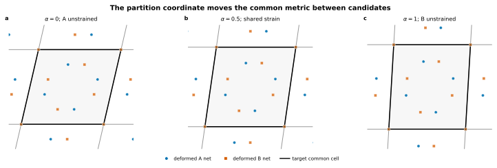
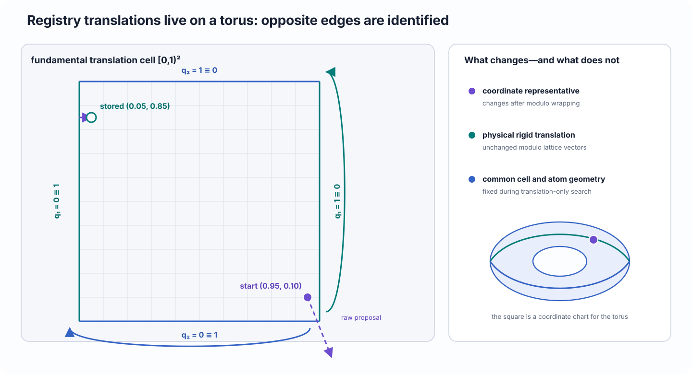

# Strain partitioning and registry

Understand the two independent choices made after coherent matching: how the common-cell mismatch is shared between the two materials, and how the slabs are translated relative to one another within that fixed cell.

## Scientific question

A coherent candidate identifies two compatible surface supercells, but an atomistic interface still requires answers to two questions:

1. Which common in-plane metric should the assembled interface use?
2. Which periodic in-plane translation places the two contact motifs against one another?

The first choice controls **strain partitioning**. The second controls **registry**. They affect different parts of the model and should be varied independently.

## Physical interpretation

A coherent interface forces both slabs into one in-plane cell. The total mismatch can be assigned mostly to side A, mostly to side B, or shared. CALM parameterizes this choice with \(\alpha\in[0,1]\).

<figure class="calm-figure calm-figure--wide" markdown>
  Scroll horizontally to inspect the complete figure.

  <figcaption>The partition coordinate moves the common metric between the two candidate metrics. The endpoints leave one side unstrained; intermediate values share the mismatch.</figcaption>
</figure>

Once the common cell is fixed, registry changes only the relative in-plane translation of the slabs. Periodic translations differing by a complete common-cell vector are physically equivalent, so registry coordinates live on a two-dimensional torus.

## Definition

Let \(\mathbf S_A\) and \(\mathbf S_B\) be the matched candidate bases, with metrics

\[
\mathbf G_A=\mathbf S_A^{\mathsf T}\mathbf S_A,
\qquad
\mathbf G_B=\mathbf S_B^{\mathsf T}\mathbf S_B.
\]

CALM uses the affine-invariant geodesic on symmetric positive-definite metrics:

\[
\mathbf G(\alpha)
=
\mathbf G_A^{1/2}
\left(
\mathbf G_A^{-1/2}\mathbf G_B\mathbf G_A^{-1/2}
\right)^{\alpha}
\mathbf G_A^{1/2},
\qquad
0\le\alpha\le1.
\]

A target basis \(\mathbf X(\alpha)\) is chosen so that

\[
\mathbf X(\alpha)^{\mathsf T}\mathbf X(\alpha)=\mathbf G(\alpha).
\]

The two in-plane deformation maps are then

\[
\mathbf F_A(\alpha)=\mathbf X(\alpha)\mathbf S_A^{-1},
\qquad
\mathbf F_B(\alpha)=\mathbf X(\alpha)\mathbf S_B^{-1}.
\]

The endpoint meanings are exact:

- \(\alpha=0\): the target metric equals \(\mathbf G_A\), so side A has zero stretch;
- \(\alpha=1\): the target metric equals \(\mathbf G_B\), so side B has zero stretch;
- intermediate \(\alpha\): both sides generally carry nonzero strain.

The midpoint \(\alpha=0.5\) is a geometric midpoint in metric space. It is not automatically the elastic-energy minimum because the two materials may have different stiffness, thickness, anisotropy, or nonlinear response.

### Registry coordinates

Let the common basis be \(\mathbf X=[\mathbf x_1\ \mathbf x_2]\). A fractional registry coordinate

\[
\mathbf q=(q_1,q_2)^{\mathsf T},
\qquad
\mathbf q\in[0,1)^2,
\]

defines the rigid translation

\[
\mathbf t=\mathbf X\mathbf q.
\]

Coordinates are periodic:

\[
\mathbf q
\sim
\mathbf q+
\begin{pmatrix}m\\n\end{pmatrix},
\qquad
m,n\in\mathbb Z.
\]

Therefore opposite edges of the unit square represent the same registry state.

<figure class="calm-figure calm-figure--wide" markdown>
  Scroll horizontally to inspect the complete figure.

  <figcaption>Registry is periodic in both common-cell directions. Wrapping the coordinate changes its representation, not the physical translation.</figcaption>
</figure>

## How CALM uses it

`BuildSettings(strain_partition=alpha)` chooses the strain partition for direct construction. `Project.refine_interfaces()` can evaluate a grid of \(\alpha\) values and select a target according to a declared metric.

`RegistrySettings` controls a bounded translation search in the common cell. The search keeps:

- the common cell fixed;
- the strain partition fixed;
- the slab compositions and contact faces fixed;
- the relative out-of-plane separation fixed unless another setting changes it.

Only the in-plane rigid translation changes during registry refinement.

A calculator-backed metric such as potential-energy density can rank the sampled strain partitions or registries. That ranking belongs to the declared calculator and protocol; it is not an intrinsic property of the geometric candidate alone.

## What the user controls

### Strain partition

Use an explicit \(\alpha\) when the epitaxial constraint is known—for example, when one side should remain close to its selected lattice state. Use a scan when the physically relevant allocation is uncertain.

A useful scan should include the relevant endpoints or neighborhood, resolve changes in the objective, and preserve the complete trace rather than only the selected value.

### Refinement metric

Choose a metric consistent with the scientific objective. Geometric strain metrics require no calculator. Energy-based metrics require a calculator suitable for both materials and every sampled configuration.

### Registry search

Control the number of steps, translation scale, temperature or acceptance policy where exposed, and random seed. Preserve these settings with the result so comparisons can be repeated.

### Initial gap and slab geometry

Registry cannot repair a severely overlapping or chemically unintended starting interface. Contact terminations, gap, vacuum, and slab thickness should be defensible before refinement begins.

## Assumptions and limitations

- \(\alpha\) is a geometric interpolation coordinate, not a direct fraction of force, stress, or elastic energy.
- A strain scan samples a finite set of states unless an analytic or continuous optimization is explicitly provided.
- Registry refinement searches translations within one fixed periodic cell; it does not create reconstructions, changes in stoichiometry, defects, or larger periodicities.
- Calculator-based refinement inherits the calculator’s accuracy and may favor artifacts of an unrelaxed or undersized model.
- A stochastic or finite registry search can miss a lower-energy translation. Repeated seeds or denser searches may be required.
- Equivalent wrapped coordinates should not be counted as distinct physical states.
- The best unrelaxed registry may change after atomic relaxation.

## Related workflow

- [Build and refine interfaces](../use/build-refine.md) gives the operational settings and inspection workflow.
- [Refine, relax, and evaluate](../learn/refine-relax-evaluate.md) demonstrates a calculator-backed scan.
- [Coherent matching, strain, and Pareto selection](coherent-matching.md) defines the mismatch being partitioned.
- [Relaxation, energy, and reference conventions](energetics.md) explains what changes when atoms are subsequently relaxed.
- [Input and settings reference](../reference/api/inputs-settings.md) gives exact `BuildSettings`, `StrainPartitionSettings`, and `RegistrySettings` signatures.

## References

- M. Moakher, “A differential geometric approach to the geometric mean of symmetric positive-definite matrices,” *SIAM Journal on Matrix Analysis and Applications* **26**, 735–747 (2005), [doi:10.1137/S0895479803436937](https://doi.org/10.1137/S0895479803436937).
- P. Neff, B. Eidel, and R. J. Martin, “Geometry of logarithmic strain measures in solid mechanics,” *Archive for Rational Mechanics and Analysis* **222**, 507–572 (2016), [doi:10.1007/s00205-016-1007-x](https://doi.org/10.1007/s00205-016-1007-x).
- N. Metropolis *et al.*, “Equation of state calculations by fast computing machines,” *Journal of Chemical Physics* **21**, 1087–1092 (1953), [doi:10.1063/1.1699114](https://doi.org/10.1063/1.1699114).
