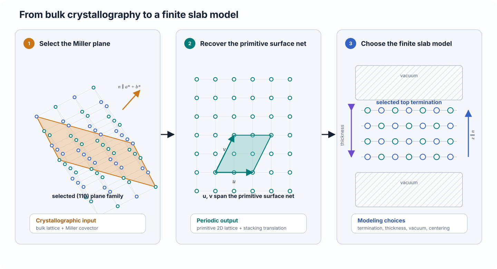

# Surface models

Understand how a crystallographic plane becomes a finite periodic slab, why one orientation can produce several terminations, and which parts of the model are exact geometry versus user-controlled approximation.

## Scientific question

A solid–solid interface model begins with two finite surface slabs. For each side, the modeling problem is:

> Which crystallographic plane, finite thickness, vacuum separation, and ordered surface termination represent the contact that will be joined?

A Miller index identifies a family of bulk lattice planes. It does **not** by itself define a unique atomistic surface. The same orientation can admit several cleavage positions, top/bottom termination pairs, slab thicknesses, and reconstructions.

## Physical interpretation

CALM separates the surface problem into three layers:

1. **Bulk crystallography** determines the plane family and its periodic in-plane translations.
2. **Finite-slab construction** chooses how much material is retained and how periodic images are separated normal to the surface.
3. **Termination selection** chooses the ordered atomic faces exposed at the top and bottom of the slab.

<figure class="calm-figure calm-figure--wide" markdown>
  Scroll horizontally to inspect the complete figure.

  <figcaption>The plane and primitive surface net follow from the bulk lattice. Termination, thickness, vacuum, and centering are additional model choices.</figcaption>
</figure>

The result is an ideal periodic model. It is best interpreted as a controlled starting point for coherent matching and atomistic calculation—not as a prediction of an equilibrium surface.

## Definition

Let the bulk direct-lattice basis be the column matrix

\[
\mathbf A=
\begin{bmatrix}
\mathbf a_1 & \mathbf a_2 & \mathbf a_3
\end{bmatrix},
\]

and let the primitive Miller covector be

\[
\mathbf m=(h,k,l)^{\mathsf T}.
\]

An integer bulk translation \(\mathbf u\in\mathbb Z^3\) lies in the selected plane when it satisfies the Weiss zone law

\[
\mathbf m^{\mathsf T}\mathbf u=0.
\]

Two independent solutions \(\mathbf u\) and \(\mathbf v\) define periodic surface translations

\[
\mathbf s_1=\mathbf A\mathbf u,
\qquad
\mathbf s_2=\mathbf A\mathbf v.
\]

Their in-plane area is

\[
A_{hkl}=\|\mathbf s_1\times\mathbf s_2\|.
\]

CALM orients the slab so that the surface normal is the nonperiodic stacking direction. The finite atomistic model then adds:

- a layer count or target thickness;
- an ordered top/bottom termination pair;
- vacuum normal to the surface; and
- a deterministic origin and wrapping convention.

A termination is not just the species in the outermost plane. It is the periodic surface motif produced by a particular cleavage shift, including its ordered top and bottom faces.

## How CALM uses it

`Project.generate_surfaces()` constructs surface alternatives from a saved material and one or more Miller indices. `Project.surfaces()` exposes the generated population for inspection, and `Project.surface()` selects one exact model.

For normal interface assembly:

- side A contributes its **top** face;
- side B contributes its **bottom** face.

That convention makes contact chemistry explicit. Two surface records with the same Miller index but different cleavage shifts or ordered faces are different scientific inputs.

Useful inspection fields include:

- parent material;
- Miller index;
- layer count or physical thickness;
- vacuum;
- top and bottom termination labels;
- termination shift;
- periodic cell and atom count.

The [Surfaces and terminations](../use/surfaces.md) chapter shows how to enumerate, inspect, and select these models.

## What the user controls

### Orientation

Choose Miller indices that represent the scientific case of interest. CALM can construct a requested orientation; it does not decide which facet is stable, exposed, or experimentally prevalent. CALM does not infer the physically correct termination.

### Thickness

The slab should be thick enough that its interior approximates the intended bulk-like environment. Convergence must be checked for the calculator and observable of interest.

A layer count gives direct crystallographic control. A target physical thickness is useful when comparing orientations with different interplanar spacings.

### Vacuum

Vacuum separates periodic slab images normal to the surface. Too little vacuum can couple the repeated slabs. The required amount depends on the calculator, electrostatics, and property being calculated.

### Termination enumeration

Enumerating terminations is appropriate when distinct cleavage shifts or ordered faces may change interface chemistry. Generating one reduced alternative is valid only when that restriction is deliberate.

### Contact-face assignment

Selecting a slab is not enough; confirm that the face used on side A or B is the intended one. Reversing the slab can change the contacting species and local motif without changing the Miller index.

## Assumptions and limitations

- CALM constructs ideal bulk-derived slabs. It does not predict reconstructions, adsorbates, vacancies, segregation, or charge compensation.
- Termination multiplicity is not a polarity analysis. CALM does not infer oxidation states, dipoles, or electrostatic stability.
- A finite slab may suppress long-period reconstructions and couple its two surfaces through an insufficiently thick interior.
- Vacuum removes direct periodic contact only approximately; calculator-specific long-range interactions may remain.
- A geometrically valid surface is not necessarily thermodynamically stable.
- Different bulk preparation states—unrelaxed, optimized, magnetic, charged, or otherwise constrained—produce different surface models.

These limitations should be treated as part of the model definition, not as post-processing details.

## Related workflow

- [Materials](../use/materials.md) prepares the bulk structures from which slabs are generated.
- [Surfaces and terminations](../use/surfaces.md) gives the operational workflow.
- [Surface cells and supercells](surface-supercells.md) explains how periodic surface cells are represented and enlarged.
- [Searches and candidates](../use/searches.md) uses two selected surfaces as the inputs to coherent matching.
- [Supported scope](../reference/supported-scope.md) summarizes the physical models CALM does and does not provide.

## References

- W. Sun and G. Ceder, “Efficient creation and convergence of surface slabs,” *Surface Science* **617**, 53–59 (2013), [doi:10.1016/j.susc.2013.05.016](https://doi.org/10.1016/j.susc.2013.05.016).
- A. H. Larsen *et al.*, “The Atomic Simulation Environment—A Python library for working with atoms,” *Journal of Physics: Condensed Matter* **29**, 273002 (2017), [doi:10.1088/1361-648X/aa680e](https://doi.org/10.1088/1361-648X/aa680e).
