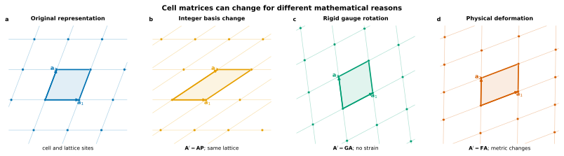

# Surface cells and supercells

Distinguish a two-dimensional lattice from one particular basis matrix, understand how integer supercells enlarge a surface model, and avoid mistaking a change of representation for physical strain.

## Scientific question

A periodic surface lattice can be described by many different pairs of basis vectors. Coherent matching also considers larger cells containing several primitive surface cells. The key questions are:

> When do two cell matrices describe the same lattice, when does one describe a superlattice, and when has the material actually been deformed?

These distinctions matter because CALM searches over surface **supercells** but reports physical mismatch only after separating representation changes from deformation.

## Physical interpretation

A cell matrix is a coordinate description of periodic translations. Changing that matrix can mean several different things:

- relabeling the same lattice with another integer basis;
- rotating the complete lattice rigidly in Cartesian space;
- selecting a larger periodic supercell; or
- physically stretching or shearing the lattice.

Only the last operation is strain. A user should therefore compare lattice metrics and atomistic geometry, not matrix entries in isolation.

<figure class="calm-figure calm-figure--wide" markdown>
  Scroll horizontally to inspect the complete figure.

  <figcaption>Similar-looking matrix operations can have different meanings. Integer basis changes and rigid rotations preserve the physical lattice; a deformation changes its metric.</figcaption>
</figure>

## Definition

CALM stores basis vectors as columns. Let the in-plane basis be the column matrix

\[
\mathbf S=
\begin{bmatrix}
\mathbf s_1 & \mathbf s_2
\end{bmatrix}
\in\mathbb R^{2\times2}.
\]

Its lattice is

\[
\mathcal L(\mathbf S)
=
\{\mathbf S\mathbf n:\mathbf n\in\mathbb Z^2\}.
\]

### Equivalent bases

If \(\mathbf U\in\mathrm{GL}(2,\mathbb Z)\) is unimodular,

\[
\det\mathbf U=\pm1,
\]

then

\[
\mathbf S'=\mathbf S\mathbf U
\]

describes the same lattice. The basis vectors and cell shape may look different, but the set of lattice points is unchanged.

### Integer supercells

For an integer matrix \(\mathbf H\) with nonzero determinant,

\[
\mathbf S_H=\mathbf S\mathbf H
\]

defines a surface supercell. Its index is

\[
n=|\det\mathbf H|,
\]

and its area is

\[
A_H=nA_0,
\qquad
A_0=|\det\mathbf S|.
\]

An index-\(n\) supercell contains \(n\) primitive lattice cells. For a repeated surface motif, its atom count also grows approximately in proportion to \(n\), before finite-slab and interface details are included.

### Rigid gauges and physical deformation

A proper Cartesian rotation \(\mathbf Q\) produces

\[
\mathbf S'=\mathbf Q\mathbf S,
\qquad
\mathbf Q^{\mathsf T}\mathbf Q=\mathbf I,
\qquad
\det\mathbf Q=1.
\]

This changes orientation but preserves the Gram metric

\[
\mathbf G=\mathbf S^{\mathsf T}\mathbf S.
\]

A physical deformation \(\mathbf F\), by contrast, produces

\[
\mathbf S'=\mathbf F\mathbf S
\]

and generally changes \(\mathbf G\). That metric change is what later gives rise to coherent strain.

## How CALM uses it

CALM begins from the periodic surface cell of each selected slab and enumerates bounded integer supercells. Each candidate therefore contains two coupled choices:

- one supercell of surface A;
- one supercell of surface B.

The search then asks whether those two enlarged lattices can be placed into one common periodic cell within the admitted strain limit.

CALM may use deterministic basis gauges internally so equivalent cells compare consistently. Those choices do not imply physical strain and are not themselves scientific ranking criteria.

User-facing candidate fields report the quantities that matter for interpretation:

- estimated interface atom count;
- interface area;
- principal coherent strains;
- total, area, and shape mismatch;
- Pareto membership;
- buildability.

The exact integer matrices are useful provenance, but users normally select candidates through these physical and computational consequences.

## What the user controls

### Supercell search bound

`max_supercell_index` limits how large the enumerated surface supercells may become. Raising it can reveal lower-mismatch matches, but it expands the search and often produces larger atomistic models.

### Atom-count bound

`max_atoms` limits the estimated size of the constructed interface. It is often the most direct control on downstream relaxation cost.

### Candidate limit

`max_candidates` limits the retained admitted population. It should not be used as a substitute for physically meaningful strain and size bounds.

### Surface primitive cell

Changing the selected termination, slab construction, or parent material changes the decorated surface model even when the underlying two-dimensional Bravais lattice is similar.

## Assumptions and limitations

- Supercell commensurability is a periodic-model condition, not proof of epitaxial growth or experimental registry.
- Larger enumeration bounds do not guarantee that a physically relevant reconstruction has been included.
- Atom-count estimates depend on slab thickness and construction conventions, not only on \(|\det\mathbf H|\).
- Equivalent basis matrices can look very different. Do not infer strain from vector lengths or angles until representation changes have been removed.
- A finite supercell constrains defects, reconstructions, dislocations, and long-wavelength relaxation modes.
- CALM’s search is bounded. “No candidates” means no admitted candidates within the declared domain, not a proof that no commensurate cell exists at any size.

## Related workflow

- [Surface models](surface-models.md) explains where the primitive surface cell comes from.
- [Searches and candidates](../use/searches.md) shows how to set supercell and atom-count bounds.
- [Coherent matching, strain, and Pareto selection](coherent-matching.md) explains how two candidate supercells are compared.
- [Build and refine interfaces](../use/build-refine.md) turns a selected supercell pair into an atomistic interface.
- [Units and conventions](../reference/units-conventions.md) defines CALM’s column-basis convention.

## References

- R. W. Grosse-Kunstleve, N. K. Sauter, and P. D. Adams, “Numerically stable algorithms for the computation of reduced unit cells,” *Acta Crystallographica A* **60**, 1–6 (2004), [doi:10.1107/S010876730302186X](https://doi.org/10.1107/S010876730302186X).
- G. L. W. Hart and R. W. Forcade, “Algorithm for generating derivative structures,” *Physical Review B* **77**, 224115 (2008), [doi:10.1103/PhysRevB.77.224115](https://doi.org/10.1103/PhysRevB.77.224115).
